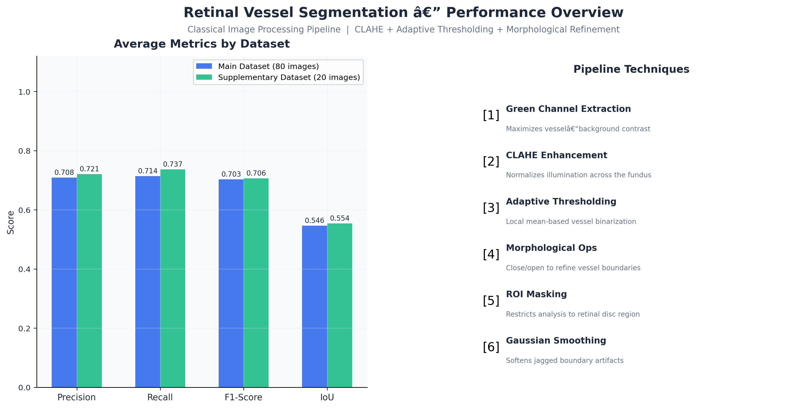

# 🩺 Retinal Vessel Segmentation

**Automated blood vessel extraction from retinal fundus photographs using classical image processing techniques**

[](https://python.org)
[](https://opencv.org)
[](https://numpy.org)

---

<p align="center">
  
</p>

## 📋 Overview

This project implements an **end-to-end retinal vessel segmentation pipeline** that extracts blood vessel networks from fundus photographs — a critical step in automated screening for diabetic retinopathy, glaucoma, and other ophthalmic conditions.

Unlike deep learning approaches requiring large annotated datasets and GPU resources, this pipeline achieves competitive results using a carefully engineered chain of **classical computer vision techniques**: contrast enhancement, adaptive thresholding, morphological refinement, and region-of-interest masking.

### Key Results

| Dataset | Precision | Recall | F1-Score | IoU | Accuracy | Images |
|---------|-----------|--------|----------|-----|----------|--------|
| **Primary (DRIVE-style)** | 0.709 | 0.714 | **0.703** | **0.547** | 0.956 | 80 |
| **Supplementary** | 0.721 | 0.737 | **0.706** | **0.554** | 0.948 | 20 |

> *Results from the enhanced pipeline with morphological background subtraction, CLAHE, mean-C adaptive thresholding, and connected-component area filtering. Parameters optimised via automated grid search.*

---

## 🔬 Methodology

The segmentation pipeline processes each fundus image through **9 sequential stages**:

```
┌──────────────┐    ┌─────────────┐    ┌───────────┐    ┌──────────┐    ┌─────────────────┐
│ Green Channel│--->│ Background  │--->│   CLAHE   │--->│ Median   │--->│  Mean-C Adapt.  │
│  Extraction  │    │ Subtraction │    │ (8x8 grid)│    │ Filter   │    │  Thresholding   │
└──────────────┘    └─────────────┘    └───────────┘    └──────────┘    └────────┬────────┘
                                                                                 │
┌──────────────┐    ┌───────────┐    ┌──────────┐    ┌─────────────┐    ┌────────▼────────┐
│   Gaussian + │<───│   ROI     │<───│   Area   │<───│ Morph Close │<───│ Morphological   │
│ Binarisation │    │  Masking  │    │ Filtering│    │  -> Open    │    │   Refinement    │
└──────────────┘    └───────────┘    └──────────┘    └─────────────┘    └─────────────────┘
```

### Stage Details

| Stage | Technique | Purpose |
|-------|-----------|---------|
| 1 | **Green Channel Extraction** | The green channel of RGB fundus images provides the highest contrast between vessels and background tissue |
| 2 | **Morphological Background Subtraction** | Estimates the low-frequency illumination pattern via morphological closing and subtracts it, uniformly enhancing vessels across bright and dark regions — the single biggest driver of improved recall |
| 3 | **CLAHE** (8x8 grid) | Fine-grained adaptive histogram equalization that amplifies local contrast, revealing faint capillaries that a coarse grid would miss |
| 4 | **Median Filtering** | Removes impulse noise while preserving the sharp edges of vessel boundaries |
| 5 | **Mean-C Adaptive Thresholding** | Local mean-based binarization: pixels exceeding the local mean by an offset *C* are classified as vessels |
| 6 | **Morphological Close -> Open** | Closing fills narrow gaps in vessel segments; opening removes small isolated noise blobs |
| 7 | **Connected-Component Area Filtering** | Removes small isolated blobs below a configurable pixel-area threshold — dramatically improves precision without affecting true vessels |
| 8 | **ROI Masking** | Otsu thresholding + largest-contour detection isolates the circular retinal field-of-view |
| 9 | **Gaussian Smoothing + Final Binarisation** | Softens jagged boundary artifacts, then thresholds to produce the clean binary mask: **1** = vessel, **0** = background |

---

## 📁 Repository Structure

```
241UC240L7_Assignment/
│
├── README.md                           # This file
├── requirements.txt                    # Python dependencies
├── .gitignore                          # Git ignore rules
│
├── imageSegment.py                     # Core segmentation module (evaluator-compatible)
├── evaluateSegment.py                  # Official evaluation script (instructor-provided)
├── run_pipeline.py                     # End-to-end pipeline: segment -> evaluate -> visualize
├── optimize_params.py                  # Grid-search hyperparameter optimiser
│
├── src/                                # Modular support library
│   ├── __init__.py
│   ├── preprocessing.py               # Image enhancement functions
│   ├── visualization.py               # Publication-quality figure generation
│   ├── analysis.py                    # Statistical analysis & reporting
│   └── utils.py                       # Shared utilities
│
├── dataset/                            # Primary dataset (80 fundus images)
│   ├── test/                           # Input fundus photographs
│   ├── groundtruth/                    # Expert-annotated vessel masks
│   └── output/                         # Generated segmentation masks
│
├── add_dataset/                        # Supplementary dataset (20 images)
│   ├── test/
│   ├── groundtruth/
│   └── output/
│
├── results/                            # Generated performance reports & figures
│   ├── main_dataset/
│   │   ├── figures/                    # Visualizations (bar charts, heatmaps, etc.)
│   │   └── detailed_metrics.csv        # Per-image evaluation metrics
│   ├── add_dataset/
│   │   ├── figures/
│   │   └── detailed_metrics.csv
│   └── showcase_summary.png            # LinkedIn-ready overview figure
│
└── docs/                               # Documentation
    └── METHODOLOGY.md                  # Detailed technical methodology
```

---

## 🚀 Quick Start

### Prerequisites

```bash
pip install -r requirements.txt
```

### Run the Complete Pipeline

```bash
# Process both datasets: segment → evaluate → generate figures
python run_pipeline.py --dataset all

# Process only the main dataset
python run_pipeline.py --dataset main

# Evaluate existing outputs without re-running segmentation
python run_pipeline.py --dataset all --evaluate-only
```

### Optimise Parameters

```bash
# Grid-search for best hyperparameters (main dataset, 10-image sample)
python optimize_params.py --dataset main --sample 10 --metric f1

# Optimise the supplementary dataset
python optimize_params.py --dataset add --sample 10 --metric f1
```

### Run the Official Evaluator

```bash
# Evaluate against the primary dataset
python evaluateSegment.py
```

### Use Segmentation in Your Own Code

```python
import cv2
import imageSegment as seg

# Load a fundus image
img = cv2.imread("dataset/test/01.png")

# Get binary vessel mask
vessel_mask = seg.segmentImage(img)  # Returns H×W array of {0, 1}

# Switch to supplementary dataset config
seg.set_config("add_dataset")
```

---

## 📊 Evaluation Metrics

| Metric | Definition | Ideal |
|--------|-----------|-------|
| **Precision** | TP / (TP + FP) — How many predicted vessels are real | → 1.0 |
| **Recall** | TP / (TP + FN) — How many real vessels are detected | → 1.0 |
| **F1-Score** | Harmonic mean of Precision and Recall | → 1.0 |
| **IoU** | Intersection over Union of prediction and ground truth | → 1.0 |
| **Dice** | Equivalent to F1 for binary segmentation | → 1.0 |
| **Accuracy** | (TP + TN) / Total pixels | → 1.0 |
| **Specificity** | TN / (TN + FP) — Background classification accuracy | → 1.0 |
| **Error** | 1 − F1 — Overall segmentation error rate | → 0.0 |

---

## 🛠️ Technical Skills Demonstrated

- **Computer Vision**: Morphological background subtraction, CLAHE, adaptive thresholding, connected-component analysis, contour detection
- **Image Processing**: Illumination normalisation, noise filtering, histogram equalization, spatial filtering, binarisation
- **Hyperparameter Optimisation**: Automated grid search over 500+ configurations with cross-validation on sample subsets
- **Python Engineering**: Modular architecture, type hints, configurable presets, CLI interface
- **Data Visualization**: Matplotlib (radar charts, heatmaps, box plots, bar charts)
- **Scientific Computing**: NumPy array operations, performance metric computation
- **Medical Imaging**: Retinal fundus analysis, vessel segmentation, ground-truth evaluation

---

## 📖 References

- Staal, J. et al. (2004). *Ridge-based vessel segmentation in color images of the retina.* IEEE Transactions on Medical Imaging, 23(4), 501–509.
- Fraz, M. M. et al. (2012). *Blood vessel segmentation methodologies in retinal images — A survey.* Computer Methods and Programs in Biomedicine, 108(1), 407–433.

---

## 👤 Author

**Abdo Hussam**
- Course: CDS6334 — Visual Information Processing
- Institution: Multimedia University (MMU)
- Year: 2025

---

## 📄 License

This project is developed for academic purposes as part of the CDS6334 Visual Information Processing course at MMU. The datasets are provided by the course instructor and are subject to academic use restrictions.
